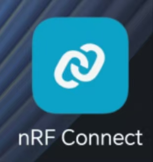
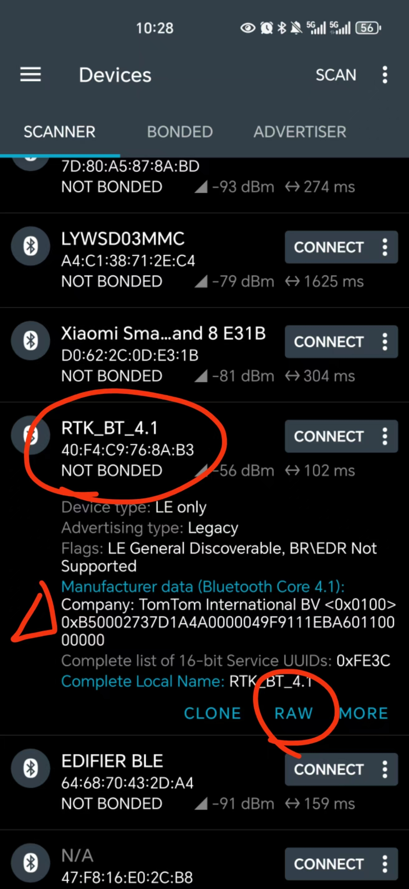
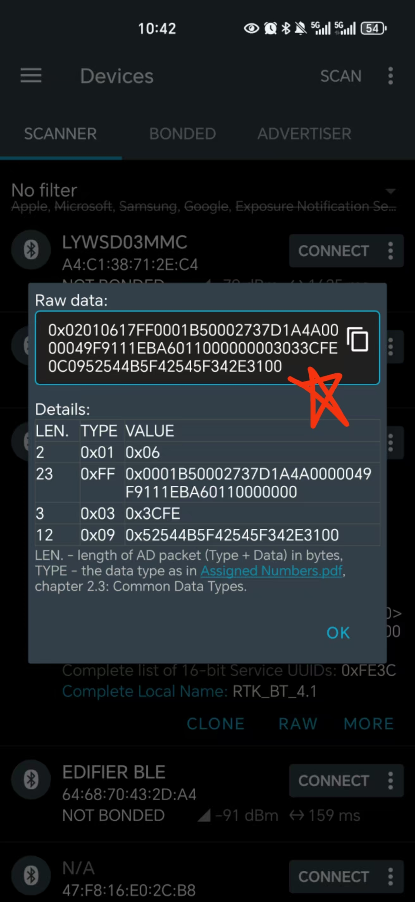

# 钉钉蓝牙打卡助手

帮助需要天天打卡的牛马们，在任何时间任何地点均可打卡

## 适用的打卡方式

**在打卡机的蓝牙范围内扫脸打卡**

目前，该仓库仅适用于静态蓝牙地址和广播数据的打卡机（一般情况下都是静态的）

## 环境

PlatformIO + arduino

最新版本的 PlatformIO 和 ESP32 库均测试通过。

## 已经测试过的适配设备

* esp32
* esp32-C3

## 如何获取mac地址和RAW广播数据

1. 下载APP `nRF Connect`

2. 打开APP，扫描当前环境中的蓝牙
3. 钉钉打卡机的蓝牙一般叫 `RTK_BT_**`，不过也不一定。然后公司的名称是 `TomTom **`，符合这两个特征的基本就是了

4. 将mac地址（蓝牙名称下面的那6位数字）填入 `main.cpp` 中对应的数组中
5. 点击`RAW` 查看广播的RAW数据，将raw数据也填入 `main.cpp` 中对应的数组中。

## 配置方法和参考链接

蓝牙地址和广播数据查询、可以参考这位哥们儿的仓库：

https://github.com/skysilksock/dingding

## 温馨提示

请各位师弟师妹不要偷袭，武林讲究点到为止，不要竭泽而渔，一定要讲究可持续发展……
